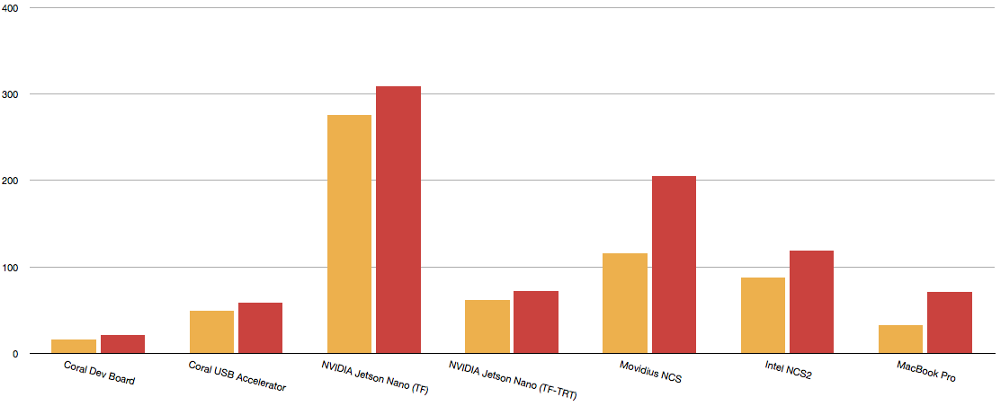

# Bench-marking Edge Computing

> Comparing Google, Intel, and NVIDIA accelerator hardware

## Compare inferencing on the following platforms

-  [Coral Dev Board](https://coral.ai/products/dev-board),
- [NVIDIA Jetson Nano](https://developer.nvidia.com/embedded/jetson-nano-developer-kit)
- [Coral USB Accelerator](https://coral.ai/products/accelerator) + [Raspberry Pi](https://www.raspberrypi.org/products/raspberry-pi-3-model-b)
-  [Movidus Neural Compute Stick](https://software.intel.com/content/www/us/en/develop/hardware/neural-compute-stick.html) + [Raspberry Pi](https://www.raspberrypi.org/products/raspberry-pi-3-model-b)
-  [Intel Neural Compute Stick 2](https://ark.intel.com/content/www/us/en/ark/products/140109/intel-neural-compute-stick-2.html) + [Raspberry Pi](https://www.raspberrypi.org/products/raspberry-pi-3-model-b)
- [Apple MacBook Pro 2016 (4x Intel Core i7 @ 2.9 GHz)]((https://support.apple.com/kb/SP749))
- [Raspberry Pi (without any acceleration)](https://www.raspberrypi.org/products/raspberry-pi-3-model-b)

Initial benchmark run was with the [MobileNet v2 SSD](http://download.tensorflow.org/models/object_detection/ssd_mobilenet_v2_coco_2018_03_29.tar.gz) and [MobileNet v1 SSD](http://download.tensorflow.org/models/object_detection/ssd_mobilenet_v1_0.75_depth_300x300_coco14_sync_2018_07_03.tar.gz) models, both models trained on the [Common Objects in Context](http://cocodataset.org/#home) (COCO) dataset.

A single 3888×2916 pixel [test image](https://www.dropbox.com/sh/osmt73s6f0uuw5k/AACYOaB1ezJUC2JuWA4wQg4Wa?dl=0&preview=fruit.jpg) was used which contained two [recognisable objects](https://gist.github.com/aallan/fbdf008cffd1e08a619ad11a02b74fa8) in the frame, a banana🍌 and an apple🍎. 

The image was resized down to 300×300 pixels before presenting it to the model, and each model was run 10,000 times before an average inferencing time was taken.

## Part I — Benchmarking

### A more in-depth analysis of the results

enchmarking was done using [TensorFlow](https://www.tensorflow.org/), or for the hardware accelerated platforms that do not support TensorFlow their native framework, using the same models used on the other platforms converted to the appropriate native framework. For the Coral [EdgeTPU-based hardware](https://medium.com/@aallan/hands-on-with-the-coral-dev-board-adbcc317b6af) we used [TensorFlow Lite](https://www.tensorflow.org/lite), and for Intel’s [Movidius-based hardware](https://blog.hackster.io/getting-started-with-the-intel-neural-compute-stick-2-and-the-raspberry-pi-6904ccfe963) we used their [OpenVINO toolkit](https://software.intel.com/en-us/openvino-toolkit). We’ll also benchmarked the NIVIDIA’s Jetson Nano both with ‘vanilla’ TensorFlow (with GPU support), and then again with the same TensorFlow model but optimised using NVIDIA’s [TensorRT](https://developer.nvidia.com/tensorrt) framework.

|  |  |
| :-------------------------------------------: | :--------------------------------------: |

Inferencing was carried out with the [MobileNet v2 SSD](http://download.tensorflow.org/models/object_detection/ssd_mobilenet_v2_coco_2018_03_29.tar.gz) and [MobileNet v1 0.75 depth SSD](http://download.tensorflow.org/models/object_detection/ssd_mobilenet_v1_0.75_depth_300x300_coco14_sync_2018_07_03.tar.gz) models, both models trained on the [Common Objects in Context](http://cocodataset.org/#home) (COCO) dataset. The 3888×2916 pixel [test image](https://www.dropbox.com/sh/osmt73s6f0uuw5k/AACYOaB1ezJUC2JuWA4wQg4Wa?dl=0&preview=fruit.jpg) was resized down to 300×300 pixels before presenting it to the model, and each model was run 10,000 times before an average inferencing time was taken. The first inferencing run, which takes longer due to loading overheads, was discarded.

Benchmarks were carried out twice on the NVIDIA Jetson Nano, first using vanilla TensorFlow models, and a second time using those models after optimisation using NVIDIA’s [TensorFlow with TensorRT](https://github.com/tensorflow/tensorrt) library.

Unsurprisingly the unaccelerated Raspberry Pi fairs the worst of any of the platforms we benchmarked, managing to sustain inferencing at just 1 to 2 fps.

If you’re interested in pushing the performance of the Raspberry Pi you could try building [TensorFlow Lite for the Raspberry Pi](https://www.tensorflow.org/lite/guide/build_rpi). Unfortunately there are currently no binary distributions available, it can’t be deployed using `pip`. So if you want to try out TensorFlow Lite, you’d going to have to build it from source either by cross-compiling, or natively on the Raspberry Pi itself. I’m not going to go down that route right now, so instead we’ll drop the Raspberry Pi as an outlier, and take a closer look at the other platforms.

Our results from the Jetson Nano are particularly interesting when compared against the [benchmarking results](https://devblogs.nvidia.com/jetson-nano-ai-computing/) released by NVIDIA for the board.

We’re seeing a significant slower inferencing in our own benchmarking using TensorFlow than in the NVIDIA tests, around ×3 slower with MobileNet v2 SSD. However going back to their original code, which was written in C++ and uses native [TensorRT](https://developer.nvidia.com/tensorrt) for inferencing, and following their [benchmarking instructions](https://devtalk.nvidia.com/default/topic/1050377/jetson-nano/deep-learning-inference-benchmarking-instructions/) I was able to successfully reproduce their published MobileNet V2 benchmark performance times.

While our models optimised using TensorRT run considerably faster on the Jetson Nano than vanilla TensorFlow models, they still don’t run as fast as the those in the original NVIDIA C++ benchmark tests. Talking with NVIDIA they tell me that this isn’t just the difference between a compiled and an interpreted language, between C++ and Python.

